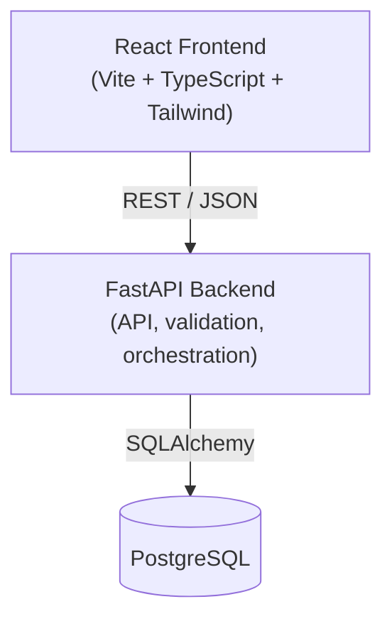
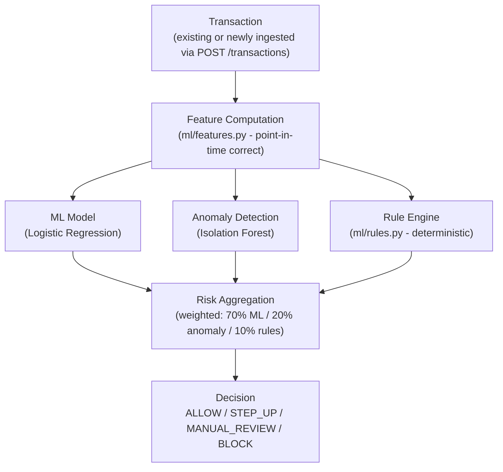
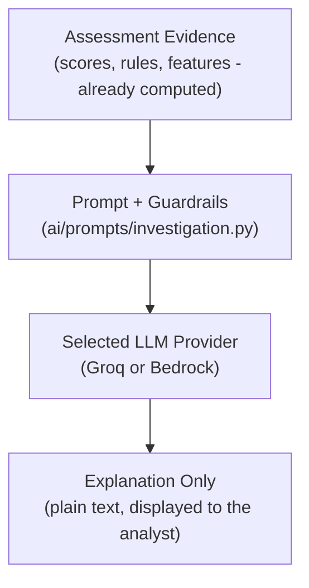
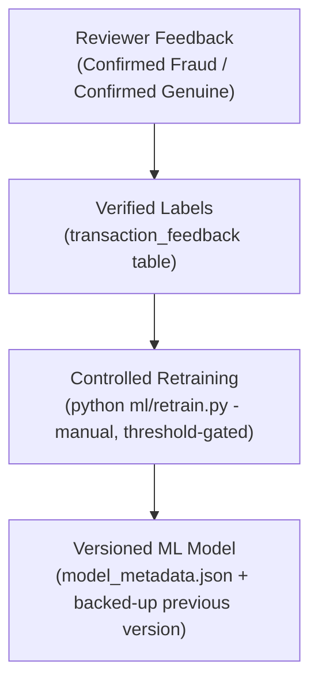

# Verisyn - Fraud Intelligence Platform

Real-time, AI-assisted fraud detection and investigation platform for a
digital lending ecosystem.

## Problem Being Solved

Digital lending platforms face increasingly sophisticated and evolving
fraud patterns that static, rule-only systems struggle to catch. This
platform combines rule-based checks, supervised ML, and anomaly detection
to score incoming transactions in real time, routes suspicious activity
through a decision engine (ALLOW / STEP_UP / MANUAL_REVIEW / BLOCK), and
gives analysts an AI-assisted, evidence-grounded explanation during
investigation - plus a controlled way to feed verified reviewer
corrections back into the model.

The system is an **internal Fraud Operations and Investigation Platform**
for fraud analysts.


## What's there

- **Fraud scoring pipeline** - Logistic Regression + Isolation Forest
  (anomaly) + a deterministic rule engine, combined via weighted risk
  aggregation into a `final_risk_score` (0-100), a risk level
  (LOW/MODERATE/HIGH/CRITICAL), and a decision
  (ALLOW/STEP_UP/MANUAL_REVIEW/BLOCK).
- **Real-time ingestion** - `POST /transactions` validates, stores, and
  immediately assesses a new transaction with the same pipeline used
  everywhere else.
- **Investigation UI** - Dashboard, Transactions (search/filter/paginate),
  Investigations (flags HIGH/CRITICAL or non-ALLOW transactions), a
  per-transaction detail panel with the full score/rule/feature
  breakdown, Analytics, and a read-only Rules tab.
- **AI explanation** - advisory-only, evidence-grounded plain-language
  explanation of an already-computed assessment (Groq or AWS Bedrock).
  The LLM never sees raw data access and cannot alter a score or decision.
- **Controlled feedback + adaptive learning** - reviewers mark a
  transaction `Confirmed Fraud`/`Confirmed Genuine`; verified feedback
  accumulates and can be used for an explicit, manually-triggered
  retrain, gated by a minimum sample threshold, with model versioning.

## Architecture



### Assessment flow (the fraud decision - deterministic, no LLM involved)



### AI explanation flow (advisory only - never touches the flow above)



### Feedback + controlled retraining flow



**The LLM never computes or changes the fraud score/decision.** It only
explains evidence the fraud engine already produced - see
`ai/prompts/investigation.py`'s guardrails and
`backend/app/services/ai_explanation.py`. Full architecture detail:
[docs/architecture.md](./docs/architecture.md).

## Technology Stack

- **Frontend:** React, TypeScript, Vite, Tailwind CSS
- **Backend:** Python, FastAPI, Pydantic, SQLAlchemy, Alembic
- **Database:** PostgreSQL (`pgvector` extension enabled but not
  currently used - no retrieval/RAG use case exists in this prototype)
- **ML:** pandas, NumPy, scikit-learn (Logistic Regression, Isolation
  Forest)
- **AI:** Provider-abstracted LLM (Groq or AWS Bedrock), prompt templates
  with guardrails - explanation only, no embeddings/RAG/agents (not
  needed for this use case)
- **Infra:** Docker / docker-compose (PostgreSQL only)
- **Testing:** pytest

## Repository Structure

```
.
├── frontend/          React + TypeScript + Vite UI
├── backend/           FastAPI application (API, orchestration, DB access)
│   └── app/
│       ├── api/       Versioned route definitions
│       ├── core/      Config, logging, database, error handling
│       ├── models/    SQLAlchemy ORM models
│       ├── schemas/   Pydantic request/response schemas
│       └── services/  Orchestration services (fraud assessment, AI explanation)
├── ml/                Synthetic data, feature engineering, training, scoring, retraining
├── ai/                LLM provider abstraction, prompt templates, guardrails
├── database/          Alembic config and migrations
├── docs/              Architecture, requirements, and design documentation
├── tests/             Cross-cutting tests (AI abstraction sanity checks)
├── .env.example
├── docker-compose.yml
└── README.md
```

## Prerequisites

- Python 3.11+
- Node.js 20+ and npm
- Docker Desktop (for PostgreSQL)

## Environment Setup

```bash
cp .env.example .env
```

`.env` is git-ignored; never commit real credentials.

- `AI_PROVIDER` selects `groq` or `bedrock` (or leave blank - the
  "Generate AI Explanation" button degrades gracefully with no error).
- **Groq:** get a free API key at https://console.groq.com, set
  `GROQ_API_KEY` (and optionally `GROQ_MODEL`).
- **Bedrock:** set `AWS_REGION` and `BEDROCK_MODEL_ID`. AWS credentials
  are **not** read from `.env` - `boto3` resolves them from your normal
  AWS environment variables or `~/.aws/credentials`.

## How to Start PostgreSQL

```bash
docker compose up -d
```

## How to Start the Backend

```bash
cd backend
python -m venv .venv
./.venv/Scripts/activate        # Windows
# source .venv/bin/activate     # macOS/Linux
pip install -r requirements.txt
python -m alembic -c ../database/alembic.ini upgrade head
python -m uvicorn app.main:app --reload --host 127.0.0.1 --port 8000
```

Verify it's running:

```bash
curl http://127.0.0.1:8000/api/v1/health
# {"status":"ok"}
```

## How to Start the Frontend

```bash
cd frontend
npm install
npm run dev
```

Open the URL Vite prints. Use `http://127.0.0.1:<port>`, not
`http://localhost:<port>` - some Windows/Node setups resolve `localhost`
to a different loopback listener than the backend is bound to.

## Generating the Original Dataset + Training the Model

Only needed once, or if you want to regenerate from scratch:

```bash
python ml/data/generate.py    # synthetic customers/accounts/transactions/events
python ml/data/load.py        # loads the generated dataset into PostgreSQL
python ml/features.py         # point-in-time feature engineering -> ml/data/training_features.csv
python ml/model.py            # trains + saves the Logistic Regression classifier
python ml/anomaly.py          # trains + saves the Isolation Forest anomaly detector
```

## Seeding Demo Transactions

A small, clearly `DEMO-`-prefixed, idempotent set of transactions
exercising specific fraud scenarios (large-amount outlier, velocity
burst, new device/IP, failed-login burst, device/IP "farm"). Safe to
re-run - already-seeded transactions are skipped, not duplicated:

```bash
cd backend
./.venv/Scripts/python.exe ../ml/data/seed_demo.py
```

Each demo transaction is submitted through the real `POST /transactions`
endpoint, so it goes through the same validation/storage/assessment path
as any other transaction - no score is ever assigned by the script.

## Reviewing & Feeding Back

In the app, open a transaction (e.g. one of the `DEMO-` ones, marked with
a small "Demo" badge) and use the **Confirm Fraud** / **Confirm Genuine**
buttons in the investigation panel. This stores a reviewer verdict
(`transaction_feedback` table) - it does **not** change that
transaction's score or decision.

## Controlled Retraining

A manual, explicit script - never runs automatically, never triggers on
a single transaction, never learns from the model's own predictions:

```bash
cd backend
./.venv/Scripts/python.exe ../ml/retrain.py
```

Requires at least 20 verified feedback samples with at least 3 of each
label (`confirmed_fraud`/`confirmed_genuine`) - otherwise it refuses and
leaves the current model untouched. On success it backs up the previous
model (`*.joblib.bak`), activates the newly trained one, and writes
`ml/models/model_metadata.json` (version, trained_at,
feedback_samples_used, metrics). **Restart the backend** to pick up the
new model (same as after `python ml/model.py`). Current version/metadata
is visible via `GET /api/v1/fraud/model-info` and in the app's Rules tab
("Adaptive Learning").

## How to Run Tests

Backend:

```bash
cd backend
./.venv/Scripts/python.exe -m pytest -q
```

AI abstraction sanity checks (repo root):

```bash
backend/.venv/Scripts/python.exe -m pytest tests/ -q
```

## Out of Scope (Intentionally)

To keep this prototype finishable and its scope traceable to the actual
requirements, the following are deliberately not implemented:

- **Authentication/authorization** - internal single-operator hackathon
  tool; no multi-user access control need.
- **RAG / vector search / embeddings** - the AI explanation prompt is
  fully self-contained (the evidence the fraud engine already produced);
  there's no genuine retrieval need. `pgvector` is enabled in Postgres
  but unused.
- **Agent frameworks** - a single grounded prompt call is the right shape
  for "explain this evidence"; no multi-step reasoning is needed.
- **Kafka / Celery / queues / microservices** - "real-time" here means
  synchronous request/response (`POST /transactions` assesses inline),
  which is the correct interpretation at this scale and requirement.
- **Automatic/continuous retraining** - retraining is always manual and
  explicit, gated by a minimum verified-feedback threshold, exactly as
  specified.
